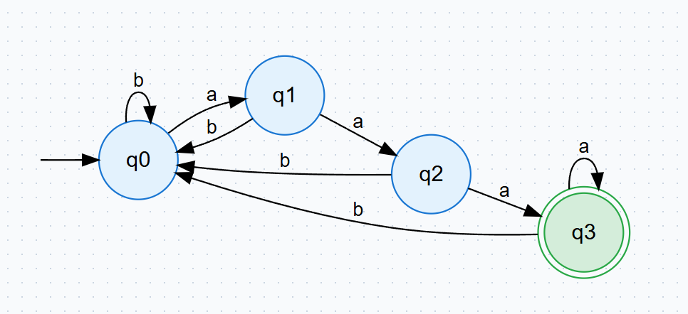

# GraphGen Client

GraphGen is an AI-powered diagram generation platform that converts natural-language prompts (and, for flowcharts, source code) into visual diagrams such as Theory of Computation (TOC) automata (DFA/NFA), Flowcharts, ER diagrams, Data Structures, and UML diagrams.

🔗 **Live App:** https://graphgen1.vercel.app


---

## Website Workflow (End-to-End)

### 1) Landing Page (`/`)
- View product overview, features, and contact links.
- Switch light/dark theme from the top navigation.
- Continue to authentication via **Log in** or **Sign up**.

### 2) Login (`/login`)
- Authenticate using email/password or Google OAuth.
- On success, token + username are stored in local storage.
- User is redirected to the dashboard workspace (`/home`).

### 3) Dashboard Home (`/home`)
- Configure your Gemini API key in **API Key Manager** (Gemini is the LLM provider used to generate diagram DOT code; get your key from Google AI Studio).
- Explore the Learning Center guides for each diagram type.
- Navigate tools from the sidebar.

### 4) Diagram Generation Pages
Available generators:
- `TOC (Theory of Computation) → DFA` (`/home/dfa`)
- `TOC (Theory of Computation) → NFA` (`/home/nfa`)
- `Flowchart` (`/home/flowchart`)
- `ER Diagram` (`/home/er-diagram`)
- `Data Structure` (`/home/data-structure`)
- `UML Diagram` (`/home/uml-diagram`)

Common workflow on generator pages:
1. Enter prompt/code input.
2. Choose AI model.
3. Generate diagram (Graphviz DOT output rendered visually).
4. Export result as PNG.
5. Save generation in History.

### 5) History (`/home/history`)
- View all generated outputs grouped by type.
- Search and filter previous generations.
- Restore an item back into its original generator page.
- Delete history entries when needed.

### 6) Profile & Session
- Access profile from the top-right avatar menu.
- Logout clears local session and redirects to login.

---

## Visuals from the Application

### Learning Center DFA Example


---

## Tech Stack
- **Frontend:** React + Vite
- **Routing:** React Router
- **Rendering:** Graphviz (`graphviz-react`)
- **Editor (Flowchart code mode):** Monaco Editor
- **HTTP Client:** Axios

---

## Local Development

```bash
npm install
npm run dev
```

Build and lint:

```bash
npm run lint
npm run build
```
